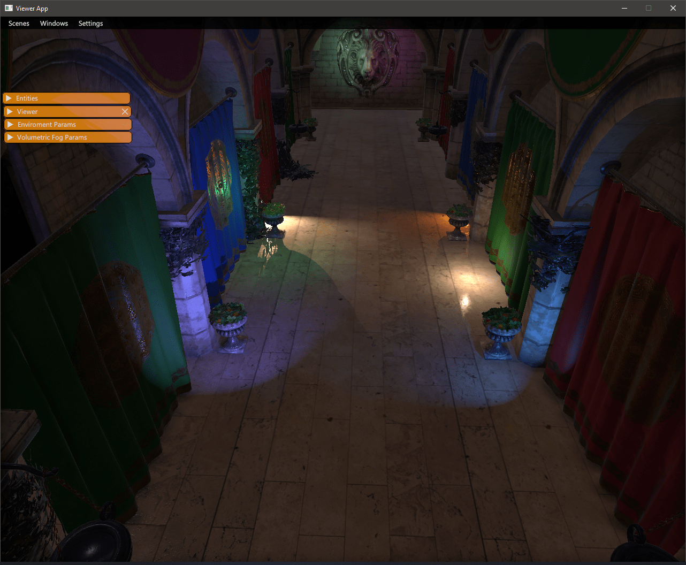
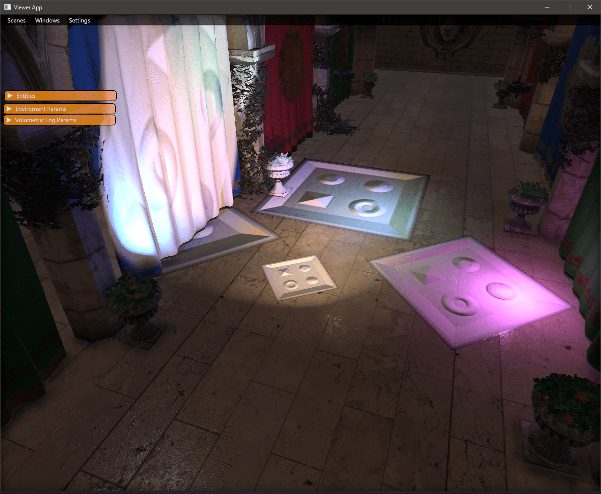
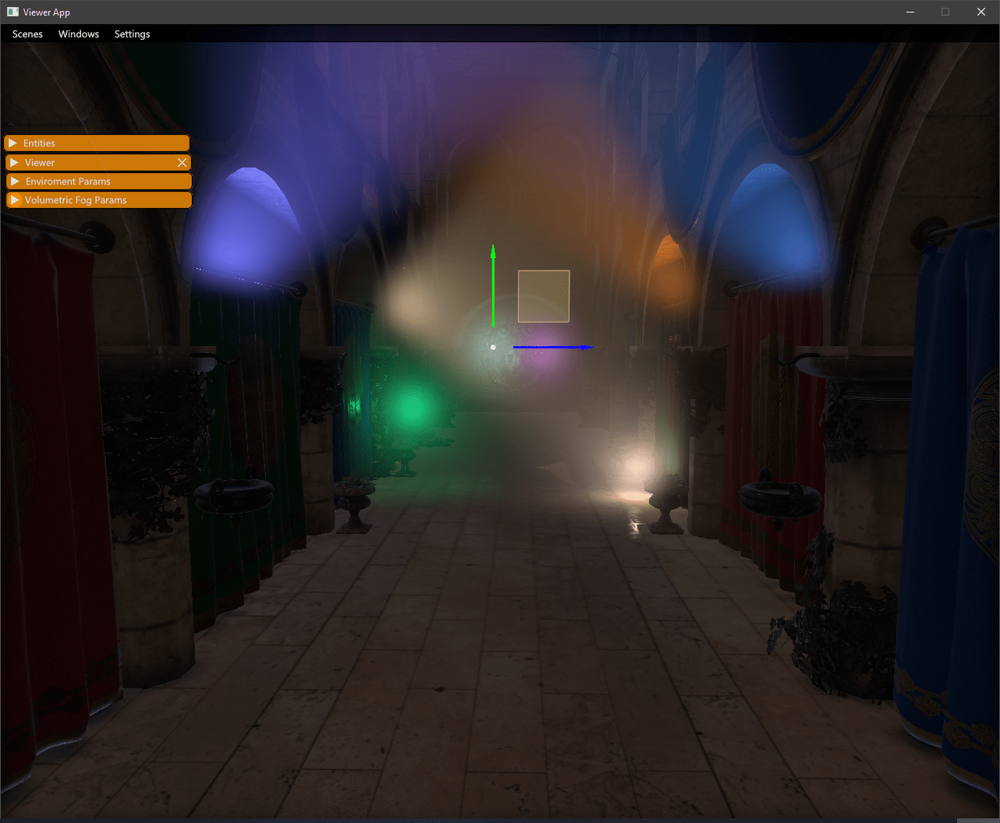
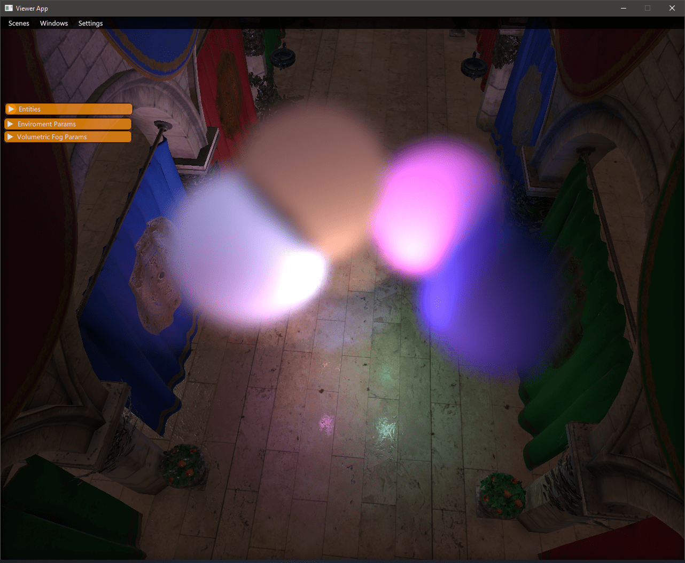
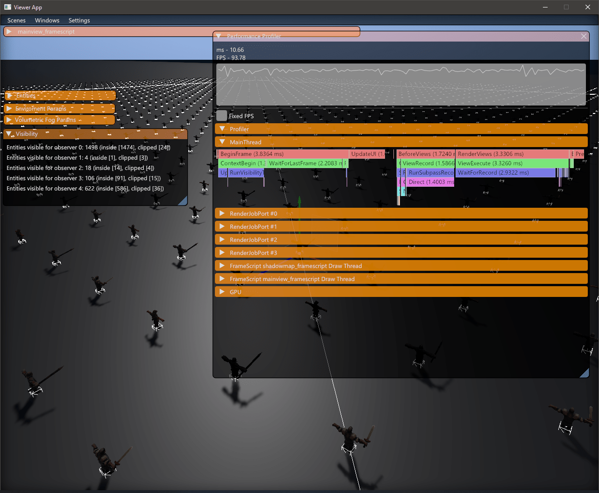

# Nebula engine   

Get in contact on Discord! https://discord.gg/gwbaVg
## Requirements
1. OS: Windows and Linux(WIP)
2. Compiler with support for C++17.
3. GPU and drivers supporting Vulkan 1.2+
4. [CMake 3.13+](https://cmake.org/download/)
5. [Python 3.5+](https://www.python.org/downloads)
    * Python requirements (Windows):
        1. Correct architecture (64-bit if you're building for 64-bit systems)
        2. Installed for all users
        3. Added to PATH
        4. Installed with debugging symbols and binaries

## Setup

#### Setup config

1. `./fips set config vulkan-win64-vstudio-debug` in your project directory

#### Build project

In your project directory:

  1. `fips physx build win-vs15`
  2. `fips anyfx setup`
  3. `fips build`
  4. `fips physx deploy`

#### Set environment variables

Remember to run `fips nebula` verb to set work and toolkit directory registry variables:

  * `fips nebula set work {PATH}`
  * `fips nebula set toolkit {PATH}`

## Features
Nebula is being developed continuously, which means that features keep getting added all the time. Currently, we support this:

* Completely data-driven design from bottom to top.
* Data structure suite, from containers to OS wrappers, everything is designed for performance and minimal call stacks.
* Multithreading.
* SSE-accelerated and intuitive maths library.
* Full python supported scripting layer.
* Advanced rendering framework and shaders.
* Test-benches and benchmarking.
* Profiling tools.

#### Rendering
A lot of effort has been made to the Nebula rendering subsystem, where we currently support:

* Unified clustering system - fog volumes, decals and lights all go into the same structure.
* Screen-space reflections - working condition, but still work in progress.
* SSAO - Horizon-based ambient occlusion done in compute.
* Physically based materials and rendering.
* Deferred lighting.
* Multi-threaded subpass recording.
* Shadow mapping for local lights and CSM for global/directional/sun light.
* Volumetric fog and lighting.
* Geometric decals. 
* CPU-GPU hybrid particle system.
* Skinning and animation.
* Scripted rendering path.
* Vulkan.
* Tonemapping.
* Asynchronous compute.

## Screenshots
Deferred Lighting using 3D clustering and GPU culling.

Geometric decals, culled on GPU and rendered in screen-space.

Volumetric fog lighting.

Local fog volumes.

Profiling tools.

